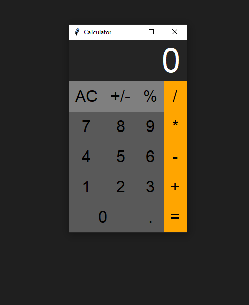

Gui calculator v.2.0 
        what is new(20/08/2024)
                * Add some Guii interface
                * cleaning button CALLED(AC)
                * calcutate pecentage(%)
                * convert "-","+" of numbers as user prefer

if you want to test ,RUN CALCULATOR.PY file  (new version)

